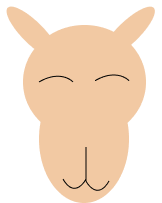

<p align="center"></p>
<h1 align="center">Camel CMS</h1>

## About Camel CMS

Camel CMS is a simple, text-focused Content Management System. It provides a page editor for creating basic pages, a profile/account manager, and a site settings page for customizing your site. The primary focus is to provide a small editor for creating pages, built upon the Laravel framework, with a separate file path for creating custom content.

#### How to create your own themes

At the root of your CMS directory is an `includes/themes/` directory, which is where all theme files should be placed. These themes can include CSS and JS files, as well as any other templates for pages/components. It is already integrated into the Composer Autoloader, so it can be accessed throughout the application if you need to extend functionality.

## Deploy Guides

### Prerequisites

You should have [PHP](https://www.php.net/), [Composer](https://getcomposer.org/download/), and [Node.js](https://nodejs.org/en) installed locally in order to build and run Camel CMS from your `localhost`.

### Deployment

You are encouraged to follow the specific deployment steps set forth by your hosting provider. However, Camel CMS recommends using [Laravel Forge](https://forge.laravel.com/) for hosting, as it offers tight integration with core Laravel concepts.

Once the application is setup on your chosen provider, it is recommended that these commands are run:

`composer install`
`npm run build`
`php artisan migrate:fresh`
`php artisan db:seed`

These commands ensure that all resources are built, dependencies are installed, and that the Super User is created. If you are using Laravel Forge, then the application will need to be run in non-production mode for several commands. Alternatively, these commands can be added to your build scripts or deploy commands for CI/CD pipelines.

### Post-Deploy

In order to first access your instance of Camel CMS, navigate to `https://{yoururl.com}/login`, and use the auto-generated `SUPERUSER` credentials to log in and start creating content or other accounts. This `SUPERUSER` is unique to your instance of Camel CMS and is built using credentials in your `.env` file. Therefore, **do not** share these credentials with anyone, and feel free to delete this `SUPERUSER` account **after** you have created a personal account with your own credentials.

#### The SUPERUSER

This is an auto-generated account that uses credentials in your unique `.env` file. The format follows:

```
Username: {DB_USERNAME}@app.com
Password: {DB_PASSWORD}
```

## Camel CMS License

Camel CMS is protected under the [MIT license](https://opensource.org/licenses/MIT).

## Laravel License

The Laravel framework is open-sourced software licensed under the [MIT license](https://opensource.org/licenses/MIT).
